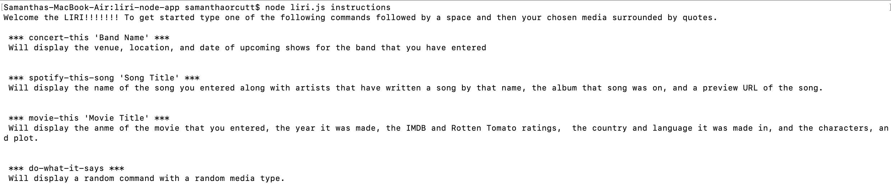
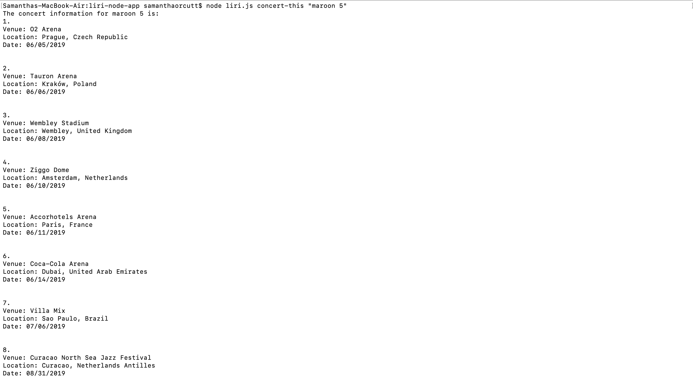
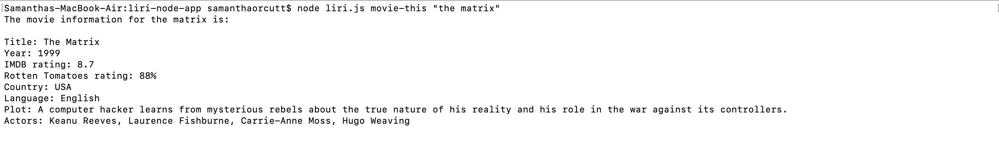
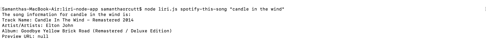
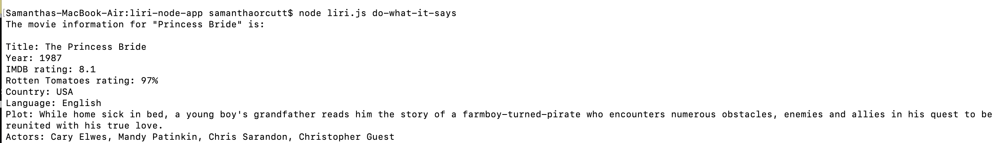

# liri-node-app

Welcome to LIRI! To run this app you will need to have your own .env file for it to work. It should be formatted like so:

```javascript
# Spotify API keys

SPOTIFY_ID=your-spotify-id
SPOTIFY_SECRET=your-spotify-secret
```

Once you have your .env file saved with the other files I have provided here you are going to want to have your terminal inside of this file and run: node liri.js instructions to vieew the instructions on how the program works. An example of this can be viewed below. 




As can be seen in the instructions there are 4 possible commands. Images of how these commands work when run are shown below. 

## concert-this
Inputs entered after the concert-this command are run throgh the bands in town api. 


## movie-this
Inputs entered after the movie-this command are run throgh the OMDB api. 


## spotify-this-song
Inputs entered after the spotify-this-song command are run throgh the spotify api. 


## do-what-it-says
The results displayed for this are chosen at random from the random.txt file, and then run through the appropriate api.



All inputs and data feed back to the user in the terminal are also saved to the log.txt file. 